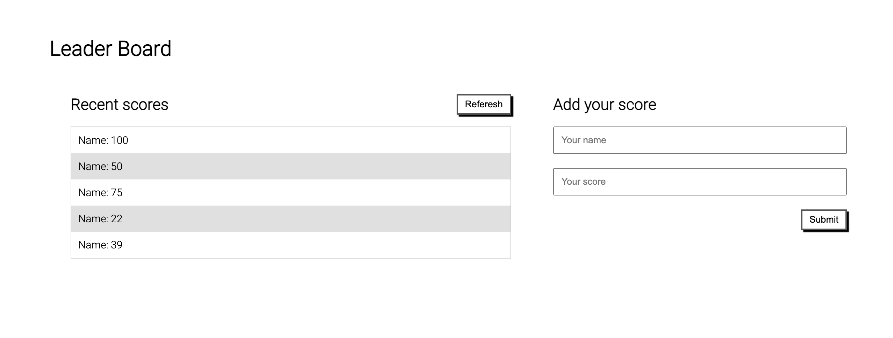

# Leader Board

Leader Board

#### App Screenshot
<!--  -->

<!-- ### Live Demo
<a href="https://ishmaelkargbo.github.io/todo-list">Leader Board</a> -->

## Built With

- HTML and CSS
- ESLint
- Webpack
- JavaScript

## Getting Started

To get a local copy up and running follow these simple example steps.

- Clone this repository to your local machine
`git clone https://github.com/IshmaelKargbo/leader-board.git`
- Go to the project filder
`cd todo-list`
- Install the required dependency
`npm install` or `yarn install`
- Run the app on development server
`npm run serve` or `yarn serve`
- Build the production ready app
`npm run build` or `yarn build`

## Authors

👤 **Ishmael Kargbo**

- GitHub: [@githubhandle](https://github.com/ishmaelkargbo)
- Twitter: [@twitterhandle](https://twitter.com/ishodev)
- LinkedIn: [LinkedIn](https://www.linkedin.com/in/ishmael-kargbo-503660169)

## 🤝 Contributing

Contributions, issues, and feature requests are welcome!

Feel free to check the [issues page](https://github.com/IshmaelKargbo/todo-list/issues).

## Show your support

Give a ⭐️ if you like this project!
